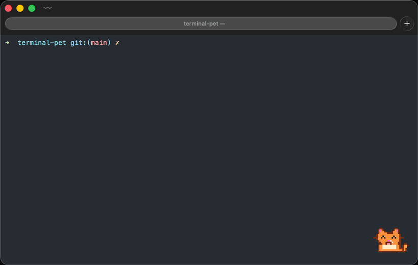

# terminal-pet

[](https://github.com/Zezoo123/terminal-pet/actions/workflows/ci.yml)
[](#install)
[](LICENSE)

A little animated Tamagotchi-like companion that lives on top of your terminal window and reacts to what you do in the shell.

<p align="center">
  
</p>

<p align="center">
  
</p>

- Sits in the corner of whichever terminal window is in front (or perched on its title bar, if you prefer), and follows it when you move or resize it.
- Hides when the terminal isn't the active app, so it never gets in the way.
- Watches your zsh session: **working** while a command runs, **happy** when it succeeds, **sad** when it fails, **sleeping** when you've been away for a while.
- Is a little Tamagotchi: it gets **hungry** over the day and asks for food, gains **xp** and **levels** from the commands you run, keeps **streaks** of successful commands, and talks in a **speech bubble**. Click it or `pet feed` it.
- Fully customisable: drop in your own animated GIFs (or APNGs) for each state, or point it at a single GIF and it'll just loop that.

macOS only for now (native Swift/AppKit, no dependencies). Linux and Windows are on the roadmap.

## Install

Requires macOS 13 or later. Works with zsh, bash and fish.

**Homebrew**

```bash
brew install Zezoo123/tap/terminal-pet
terminal-pet setup
```

**From source** (needs the Xcode Command Line Tools, `xcode-select --install`)

```bash
git clone https://github.com/Zezoo123/terminal-pet.git
cd terminal-pet
make install            # builds and installs to ~/.local (override with PREFIX=/usr/local)
~/.local/bin/terminal-pet setup
```

`setup` detects your shell from `$SHELL`, adds the matching plugin to its startup file, and puts `terminal-pet` on your PATH if it isn't already (`--shell bash` to pick explicitly, `--print` to only show the lines). Then open a new terminal and start the pet:

```bash
terminal-pet            # detaches and gives you the prompt back; `make launchd` starts it at login
terminal-pet stop       # when you've had enough
```

Run any command and watch it react.

<details>
<summary>Doing it by hand instead of <code>setup</code></summary>

| shell | add to | line |
|-------|--------|------|
| zsh   | `~/.zshrc` | `source ~/.local/share/terminal-pet/terminal-pet.plugin.zsh` |
| bash  | `~/.bash_profile` (or `~/.bashrc`) | `source ~/.local/share/terminal-pet/terminal-pet.plugin.bash` |
| fish  | `~/.config/fish/conf.d/terminal-pet.fish` | `source ~/.local/share/terminal-pet/terminal-pet.fish` |

And `export PATH="$HOME/.local/bin:$PATH"` (`fish_add_path ~/.local/bin` in fish) if `~/.local/bin` isn't on your PATH. With Homebrew the files live under `$(brew --prefix)/opt/terminal-pet/share/terminal-pet/` instead.

zsh plugin managers can load the plugin straight from the repo (the app still has to be installed): `zinit light Zezoo123/terminal-pet`, `antigen bundle Zezoo123/terminal-pet`, or clone it into `$ZSH_CUSTOM/plugins/terminal-pet` for oh-my-zsh.

</details>

### Try it without installing

```bash
make run                # runs in the foreground with the repo's pets, Ctrl-C to quit
```

## Shell integration

Each plugin hooks the shell's "command is about to run" and "prompt is about to show" events and sends one line over a Unix socket (`/tmp/terminal-pet-<uid>.sock`). It is a no-op when the pet isn't running.

| shell | plugin | how it talks |
|-------|--------|--------------|
| zsh   | [shell/terminal-pet.plugin.zsh](shell/terminal-pet.plugin.zsh) | `add-zsh-hook preexec/precmd`, zsh's built-in `zsocket`, nothing spawned |
| bash  | [shell/terminal-pet.plugin.bash](shell/terminal-pet.plugin.bash) | `DEBUG` trap + `PROMPT_COMMAND` (or bash-preexec if present), `terminal-pet send` in the background |
| fish  | [shell/terminal-pet.fish](shell/terminal-pet.fish) | `fish_preexec` / `fish_postexec` events, `terminal-pet send` in the background |

It also gives you a `pet` command:

```zsh
pet            # poke it
pet feed       # feed it
pet stats      # level, xp, hunger, streaks, age
pet say hi     # speech bubble (try it at the end of a long script)
pet name Bob   # give it a name
pet ghost      # switch to another pet (any name from `pet list`, a folder, or a .gif)
pet sad        # force a state: idle | working | happy | sad | sleeping | eating | hungry
pet scale 4    # resize
pet anchor inside-bottom-left
pet list       # what's installed
pet status
pet quit
```

## Caring for it

| | |
|---|---|
| **Hunger** | Full after feeding, empty about 8 hours later. Below 25% it looks hungry (daydreaming about its favourite snack) and asks for food every few minutes. `pet feed` (+5 xp). |
| **XP and levels** | +1 xp per successful command, +5 per meal. Level 2 at 20 xp, 3 at 80, 4 at 180, 5 at 320, and so on. It announces level-ups. |
| **Streaks** | Consecutive successful commands. It celebrates 5, 10, 25, 50, 100... and mourns a lost streak of 5 or more. |
| **Speech** | Reacts with short bubbles. `pet say "tests passed"` from any script, or `terminal-pet say ...` from bash, Makefiles, CI. |

Everything is kept in `~/.config/terminal-pet/stats.json`. Delete it to start over.

## Changing things on the fly

While a pet is running, the CLI talks to it instead of starting another one, and every change is written to the config file so it sticks:

```bash
terminal-pet --pet ghost                 # ok now showing Ghost (saved to config)
terminal-pet --scale 4
terminal-pet --anchor top-right
terminal-pet status                      # pet=Ghost state=idle anchor=top-right scale=4.0 ...
```

The same flags with no pet running start one with those settings.

Anything else can send raw events with `terminal-pet send <event>`, e.g. from a Makefile, a CI script, or bash:

```bash
terminal-pet send preexec make
terminal-pet send precmd 1      # exit status
```

## Bundled pets

| name    | who |
|---------|-----|
| `blob`  | a round blue blob (default) |
| `cat`   | an orange tabby that wags its tail |
| `ghost` | a floating ghost that bobs up and down |
| `robot` | a boxy robot whose screen face and antenna light change with its mood |
| `chick` | a yellow chick that flaps its wings when a command succeeds |
| `dog`   | a floppy-eared dog, tongue out when happy, carries its bone |
| `frog`  | a wide-mouthed frog that hops on success and dreams of flies |
| `penguin` | a penguin that waddles while working and flaps its flippers |

Pick one with `"pet": "cat"` in the config or `terminal-pet --pet cat`. `terminal-pet pets` lists everything installed.

## Configuration

`~/.config/terminal-pet/config.json` (created by `make install`, every key optional):

| key               | default       | meaning |
|-------------------|---------------|---------|
| `pet`             | `"blob"`      | pet name, a directory, or a single `.gif` file |
| `scale`           | `3`           | size multiplier for the sprite |
| `anchor`          | `"inside-bottom-right"` | `inside-bottom-right`, `inside-bottom-left`, `inside-top-right`, `inside-top-left` (over the window content), or `top-right`, `top-left` (perched on the title bar) |
| `offsetX` / `offsetY` | `16` / `16` | nudge from the anchor, in points |
| `idleAfter`       | `90`          | seconds of inactivity before it falls asleep |
| `reactionSeconds` | `2.5`         | how long happy/sad is shown |
| `pollHz`          | `30`          | how often it checks where the terminal window is |
| `smooth`          | `false`       | bilinear scaling instead of crisp pixels (for photo-like GIFs) |
| `terminals`       | see example   | app names or bundle IDs treated as terminals (Terminal, iTerm2, kitty, Alacritty, WezTerm, Ghostty, Warp, Hyper, Tabby, Rio by default) |

Flags override the file for one run: `terminal-pet --pet ~/Downloads/cat.gif --scale 1 --anchor top-right`.

## Making your own pet

A pet is a folder with one animated image per state: `idle`, `working`, `happy`, `sad`, `sleeping`, `eating`, `hungry`. Missing states fall back sensibly (`eating` to `happy`, everything else to `idle`), so a single `idle.gif` is enough.

```
~/.config/terminal-pet/pets/cat/
├── pet.json      (optional)
├── idle.gif
├── working.gif
├── happy.gif
├── sad.gif
├── sleeping.gif
└── eating.gif
```

`pet.json` lets you name it and use different file names:

```json
{ "name": "Cat", "states": { "idle": "sit.gif", "working": "typing.gif" } }
```

GIF and APNG are both supported and per-frame delays are respected. Pixel art is drawn with nearest-neighbour scaling, so a 24x24 sprite at `scale: 3` is crisp. `terminal-pet pets` lists everything it can find. Pets are searched in `$TERMINAL_PET_PETS_DIR`, `~/.config/terminal-pet/pets`, then the installed share directory.

The bundled pets are all generated from [scripts/gen-pets.swift](scripts/gen-pets.swift): each one is a small ASCII-art body plus shared helpers for eyes, mouths, tears and Zs. `make pets` regenerates them and writes a contact sheet to `.build/pets-sheet.png`. Copy one of the `func cat()`-style definitions to make a new character. `make demo` re-records the README demo from a real Terminal window (asks for Screen Recording permission once; no ffmpeg needed).

## How it works

- `Sources/terminal-pet/TerminalTracker.swift` finds the frontmost terminal window through `CGWindowListCopyWindowInfo`. Window bounds aren't permission-gated, so no Accessibility or Screen Recording prompts.
- `PetPanel.swift` is a borderless, transparent, non-activating `NSPanel` at floating level. Clicking it never steals focus.
- `AnimationView.swift` decodes frames with ImageIO and drives the timing itself, so state changes restart cleanly.
- `EventServer.swift` is a ~100-line Unix socket listener; `shell/terminal-pet.plugin.zsh` is the client.

## Contributing

New pets, new terminals, and new shells are the best ways to help. See [CONTRIBUTING.md](CONTRIBUTING.md); adding a pet is about 60 lines of Swift.

## Roadmap

- [ ] Sound / notification on long command completion
- [ ] tmux awareness (which pane is active)
- [ ] Linux (X11/Wayland overlay) and Windows

## License

MIT
